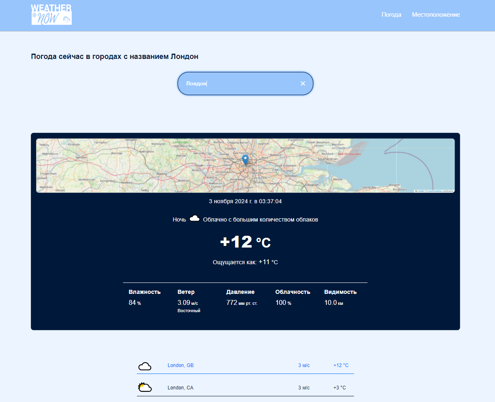

# GEOLOCATION AND CURRENT WEATHER APP 

## Description
This app requests and displays the current weather in all cities with the specified name. Also receives the current public IP address and more advanced geo data on this IP.

* [Project link](https://geoweathernow.netlify.app)


## Prerequisites
- [Node.js](https://nodejs.org/) (recommended version: 20.x or higher)
- [npm](https://www.npmjs.com/) (it is usually installed together with Node.js)
- [Git](https://git-scm.com/) (to clone a repository)

## Install
Follow these steps to install and run the project:

1. **Clone the repository**:
  ```bash
  git clone https://github.com/bidzyu/weather_now.git
  ```

2. **Go to the project directory**:
  `cd weather_now`

3. **Install dependencies**:
  `npm install`

4. **Run the project in dev mode**:
  `npm run dev`

## Technologies
**Main**:
- [React](https://react.dev) - library for creating user interfaces
- [TypeScript](https://www.typescriptlang.org/docs/) - a programming language based on JavaScript
- [Redux toolkit](https://redux-toolkit.js.org/) - a library for managing state in Redux-based applications
- [Vite](https://vite.dev/guide/) - a modern project collector
- [npm](https://www.npmjs.com) - package manager

**Styles**:
- [Sass](https://sass-lang.com) - CSS preprocessor.
- [css-modules](https://github.com/css-modules/css-modules) - A styling approach that allows you to use CSS classes in a local context, avoiding name conflicts.

**Additional**:
- [Axios](https://axios-http.com/) - A popular library for executing HTTP requests.
- [classnames](https://github.com/JedWatson/classnames) - A utility for conditionally combining CSS classes.
- [Leaflet](https://leafletjs.com/) - A lightweight library for creating interactive maps.

**API**
- [ipify](https://www.ipify.org/) - A simple API for getting a user's public IP address. It allows you to quickly and conveniently find out your IP address without additional settings.
- [ip-api.com](http://ip-api.com/) - API for getting geolocation information by IP address. Allows you to get data about the location and other characteristics of IP addresses.
- [OpenWeatherMap](https://openweathermap.org/api) - API for getting weather data. Provides information about the current weather, forecasts and other meteorological data around the world.

## Scripts

-  `npm run dev` — Runs the project in development mode with Vite.
-  `npm run build` — Compiles the project using TypeScript and creates an assembly with Vite.
-  `npm run lint` — Checks the code for errors using ESLint.
-  `npm run preview` — Preview of the project build.
